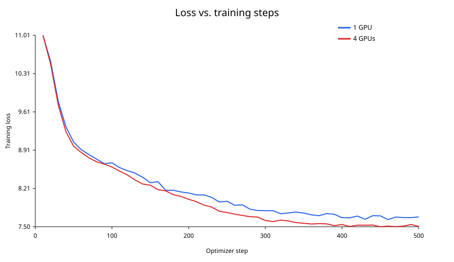
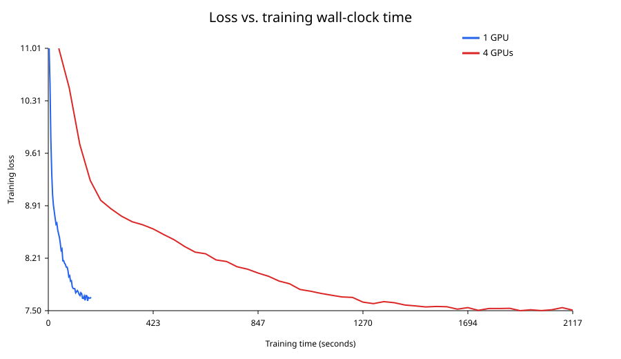

# Scaling GPT-2 Large training with PyTorch DDP

## Setup and batch-size result

`train.py` configures GPT-2 Large with 36 layers, hidden size 1280, 20 heads, and 1024 positions. The run log reports 774,030,080 trainable parameters. Power-of-two single-H100 probes found batch 32 can complete a short probe but OOMs during normal training when logits are converted to fp32; batch 16 completed the full 500-step run. Therefore batch 16 is the stable batch size used for both comparison runs.

## Loss curves

## Training performance

| Metric | 1 GPU | 4 GPUs |
|---|---:|---:|
| train runtime (s) | 172.6 | 2117.0 |
| train samples/s | 46.36 | 15.11 |
| train steps/s | 2.897 | 0.236 |
| average wall-clock step time (s) | 0.3452 | 4.2340 |

## Inference performance

| Metric | 1 GPU | 4 GPUs |
|---|---:|---:|
| eval samples/s | 179.907 | 679.028 |
| eval runtime (s) | 2.7737 | 0.7349 |
| eval loss | 6.957100868225098 | 6.848264217376709 |

## Communication

| Metric | 1 GPU | 4 GPUs |
|---|---:|---:|
| Total measured comm time (s) | 0.0000 s | 1943.2592 s |
| Total measured comm bytes | 0 bytes | 1,548,060,160,000 bytes |
| Avg comm time / all-reduce call (s) | 0.000000 s | 0.035727 s |
| Avg comm time / optimizer step (s) | 0.000000 s | 3.886518 s |
| Theoretical gradient payload / step | 3,096,120,320 bytes | 3,096,120,320 bytes |

## Did DDP improve performance?

No for this job. The 4-GPU run processed 15.11 samples/s, compared with 46.36 samples/s on one GPU: a 0.33× speedup (a slowdown), far below ideal 4× scaling. It also needed 12.3× longer to finish the same 500 optimizer steps. The loss-vs-time graph is therefore the fair comparison: the 1-GPU job reaches each logged step much earlier. The 4-GPU configuration has a four-times larger global batch (64 vs. 16), so its epoch count also differs; this is why loss-versus-steps and loss-versus-time are both included.

The communication hook measured 3.886518 s of communication per optimizer step while the observed 4-GPU step time was 4.23 s. That leaves little time for compute and accounts for the poor scaling. The measured total is accumulated across the run/ranks, so it should not be interpreted as a single rank's wall-clock duration.

## Improvements

- Use a topology with genuinely high-bandwidth, low-latency GPU-to-GPU connectivity and verify NCCL transports; the current all-reduce cost dominates.
- Increase compute per synchronization with a larger stable per-device batch or gradient accumulation, trading memory/optimization behavior for less frequent synchronization.
- Enable/better utilize mixed precision and tune DDP bucket sizes/overlap so reductions start during backpropagation.
- For models that no longer fit efficiently, use FSDP or ZeRO to shard model/optimizer state, while measuring whether their added communication is beneficial.
